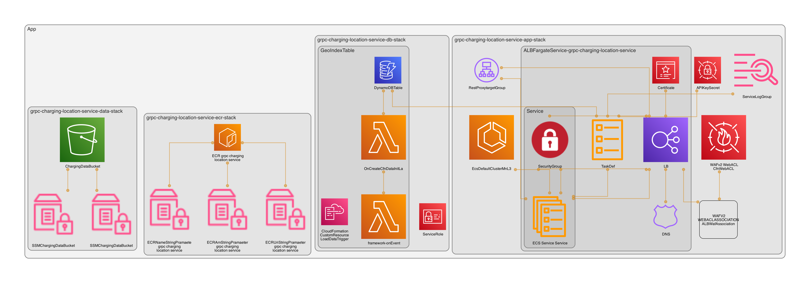

# go-grpc-geohashing-service-sample - poi-info-service

## Architecture

The service is implemented using the AWS ECS Load-Balanced Fargate Service pattern.
As for the DB, DynamoDB is used to implement a geo-index with provisioned capancity and autosacling.
The DB initiation is implemmented using a custom resource Lambda function, fetching the data from S3,
and BatchPutRequest the data set into the table. This approach was selected due to the limitations of the DynamoDB
import and lack of IaC integration. The S3 import was originally palnned to be utilized.
The Fargate service has two target groups attached, one for port 443, where the gRPC Service is listening,
and port 8443 where the gRPC GateWay REST API is listening for requests.
The ALB has a WAF associated for additional protection of the application.
The cloud architecture is visualized down below. The diagram was generated using [CDK Dia](https://github.com/pistazie/cdk-dia)


## Data Set for PoIs

The dataset processed in this service was downloaded from
[kaggle](https://www.kaggle.com/datasets/mexwell/electric-vehicle-charging-in-germany)
Collected from https://opendata.rhein-kreis-neuss.de/ by the Federal Network
Agency of Germany The dataset is licensed under the
[ATTRIBUTION 4.0 INTERNATIONAL](https://creativecommons.org/licenses/by/4.0/)
license

The data is modified and processed as part of this sample application just for
demo purposes. The modification is minimal and adjust it to the simple model
defined in the API and adds gehoashing to enable querying the data efficiently.

## Initial Deployment

The Deployment requires one manual step before everything is fully automated within GitHub Actions:
The data set needs to be downloaded and stored into the root of this project locally.
The CSV must have the name `cpoi_data.csv`. Login to AWS and assume a role which allows you to deploy stacks and run `cdk deploy \*data-stack`.
Finally run `go run cmd/data/main.go`.
After the initial setup of the S3 Bucket and the parsing of data, everything is automated.
I decided to not automate this step, since it only needs to be done once and I want to move on to other priate projects.

## Setup

Before getting statrted, set up the required tools and run `make configure`

- [protoc](https://grpc.io/docs/protoc-installation/) (not required immediate)
- [make](https://www.gnu.org/software/make/) (required)
- [buf](https://buf.build/docs/installation) (not required immediate)
- [docker](https://docs.docker.com/engine/install/) (required)
  [docker-buildx](https://github.com/docker/buildx) (required)
- [colima](https://github.com/abiosoft/colima) or
  [docker desktop](https://www.docker.com/products/docker-desktop/) (required)
- [configure GOBIN or GOPATH](https://go.dev/wiki/SettingGOPATH) (required)
- [aws cdk](https://docs.aws.amazon.com/cdk/v2/guide/getting_started.html) &
  [aws cli](https://docs.aws.amazon.com/cli/latest/userguide/getting-started-install.html) (not required immediate)

Not all is required to 'just' get started.
The generated protobuf files are committed as part of the version control, hence the protobuf tooling is optional unless needed.

### Colima and Testcontainers

If you have a Mac you might be using colima (or podman) since docker desktop (may) require a
license especially in corporate ogranizations. Make sure to correctly configure
colima (or podman):

```bash
export TESTCONTAINERS_DOCKER_SOCKET_OVERRIDE=/var/run/docker.sock
export DOCKER_HOST="unix://${HOME}/.colima/docker.sock"
```

## Install Dependencies

```bash
make ci
```

## Testing

The tests include unit and integrations in a BDD manner. For the integration
tests testcontainers is used to easily automate the container lifetime during
test suite execution.

Run tests and generate reports

```bash
make test_report
```

Run linter, vulnerability scan, tests & reports, synthesize cdk stacks, and
build container on arm machines

```bash
make test_full_local_arm
```

on amd/x86_64 machines

```bash
make test_full_local_amd
```

### Use ginkgo to bootstrap test suites

to bootstrap a new test suite in a module run

```bash
cd path/to/dir
ginkgo bootstrap
```

Checkout ginkgo [documentation](https://onsi.github.io/ginkgo/) for more
details.

## Vulnerability Checks

run vulnerability check

```bash
make vuln_scan
```

## Other Useful commands

- `cdk deploy` deploy this stack to your default AWS account/region
- `cdk diff` compare deployed stack with current state
- `cdk synth` emits the synthesized CloudFormation template
- `go mod tidy` remove unused go modules
- `go mod download` install go modules
- `go get -u ./...` update all dependencies recursive
- `ginkgo bootstrap` bootstrap ginkgo test suit into current dir

## Helpful Resources

- Google and gRPC gateway documentation
  - https://buf.build/grpc-ecosystem/grpc-gateway/docs/main:grpc.gateway.protoc_gen_openapiv2.options#grpc.gateway.protoc_gen_openapiv2.options
  - https://grpc-ecosystem.github.io/grpc-gateway/docs/mapping/customizing_openapi_output/
  - https://github.com/grpc-ecosystem/grpc-gateway
  - https://github.com/googleapis/googleapis/blob/master/google/api/http.proto

## Evaluation

### gRPC GateWay

The HTTP 2.0 based gRPC protocol is ideal for service to service communication, easy to set up and ergonomic to implement.
The idea of beating to nails with one strike and using gRPC and Protobuf to implement a REST API seem really appealing.
The advantages are:

- efficiency
- simplicity
- cross language code generation
- client and server side code generation
- light weight
- almost no noticeable perofoamnce impact by the reverse-proxy
- gRPC calls are extremely performanct

Using gRPC GateWayto generate client and server code as well as API documentation is a breeze to setup.
Implementation is straight forward and the documentation is very solid.
However the disadvantages are:

- organization not used to Protobuf might struggle
- the Protobuf annotations are hard to read
- the Protobuf annotations are not as good documented as the rest of gRPC GateWay
- openapi v3 is not supported (yet)

To summarize, gRPC is a clear win for ogranization which are already used to it and want to reduce development overhead for frontend intgeration.
For organization without expericene with gRPC or Protobuf I would not recommend the usage.

### DynamoDb for geo hashing

Using your geo hashing library of choice to implement a GIS DB on top of DynamoDB sounds appealing.
However, the disadvantages are clear:

- index predetermines query performance
- inflexible and limited number of indices

For business without clear requirements, rapid changes in needs, those issues may be immediate show stoppers.
Nevertheless, DynamoDB provides a lot of advantages:

- cheap
- easy scalability
- easy to set up multi-region tables
- scalable

In the case of clearly defined needs the advantages outweigh the disadvantages.
Additionally, implementing the geo hashing on top of DynamoDB is not that complicated and relatively easy to maintain.

Summarizing, if you now your business needs in advance and you dont expect major changes in query needs, you might be able to safe a lot of money and time by
using DynamoDB instead of PostGIS.
